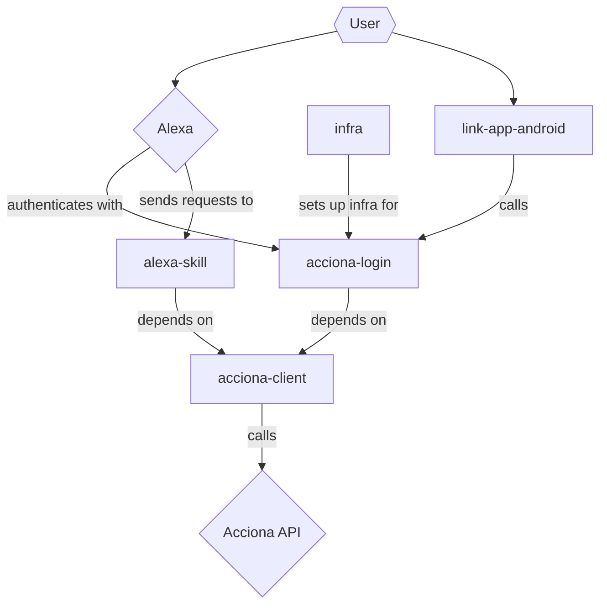
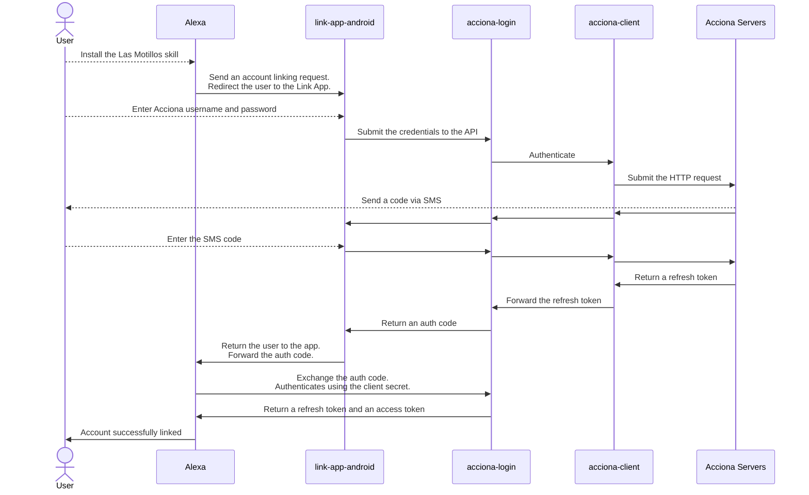
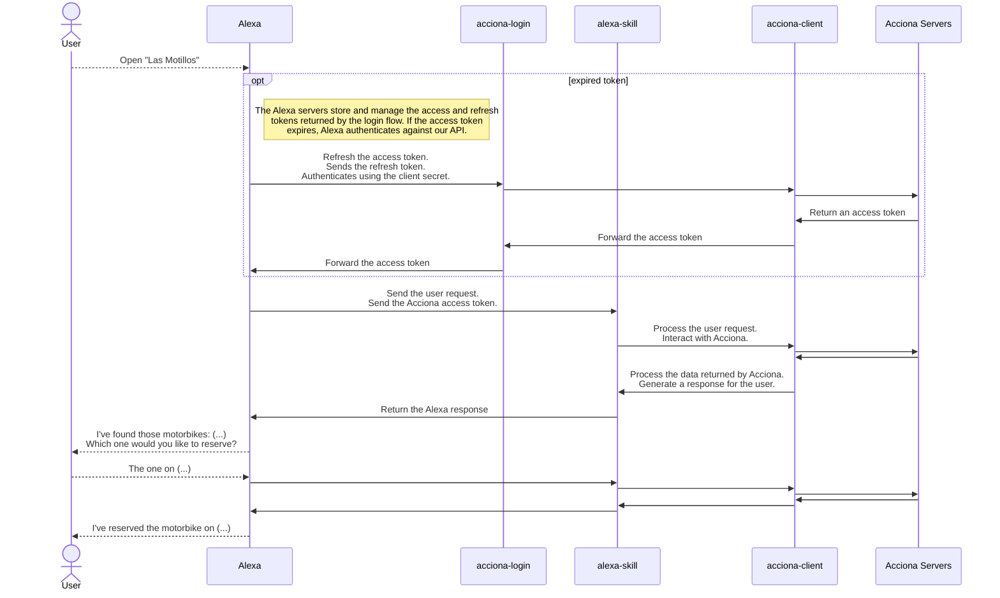

# Las Motillos Architecture

This project is composed of five modules:

* [acciona-client](#acciona-client)
* [acciona-login](#acciona-login)
* [alexa-skill](#alexa-skill)
* [infra](#infra)
* [link-app-android](#link-app-android)

### `acciona-client`

`acciona-client` is a Node API client that can make requests to the Acciona API.
It acts as a wrapper around the Acciona API and provides a simplified interface
for making requests.

[Go to README](acciona-client/README.md)

### `acciona-login`

`acciona-login` is a Next.js API that acts as an authentication bridge between
Alexa and Acciona. It is responsible for facilitating the login process and for
bridging OAuth requests from Alexa to the Acciona API.

The production version is hosted on Vercel.

### `alexa-skill`

`alexa-skill` is the actual Alexa Skill code that uses `acciona-client` to
interact with the Acciona API. It is responsible for handling user input from
Alexa, processing it and returning a response to the user.

The production version is hosted on the free Alexa servers.

### `infra`

`infra` is a set of Terraform configurations that can be used to deploy the AWS
infrastructure necessary for the project. It is also responsible for setting up
the necessary secrets on the `acciona-login` Vercel project.

### `link-app-android`

`link-app-android` is an Android app that authenticates against the
`acciona-login` API. Alexa redirects to it when the user installs the skill on
their account.

It is not possible to authenticate on the browser because the login flow is
secured by ReCaptcha and I don't own a valid domain. Hence, an Android app is
needed to manipulate the browser.

## User login flow

Here's a breakdown of how the modules interact with each other when the user
logs in.

## User request flow

Here's a breakdown of how the modules interact with each other when the user
asks Alexa to open the skill.

